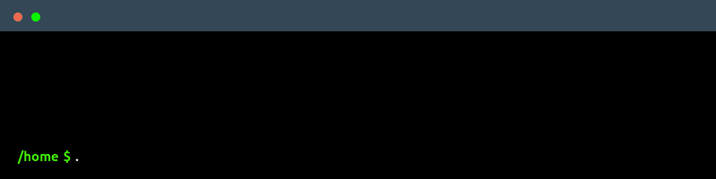

<p align="center">
  
  
  
  
  
</p>

<p align="center">
  
  
</p>

<p align="center">
  
</p>

## 🔧 Why DNS-collector?

Grab your DNS logs, detect anomalies, and finally understand what's happening on your network.

The missing piece between DNS servers and your data stack.

- **DNS-native processing**: Understands DNS protocol, EDNS, query types natively
- **Process at the edge**: Clean, filter and enrich DNS data before storage - not after
- **Multiple input sources**: DNStap streams, live network capture, log files
- **DNS-aware transformations**: Filtering noise upstream, user privacy
- **Flexible outputs**: Files, syslog, databases, monitoring tools and more...
- **Production ready**: Used in real networks, tested with major DNS servers
- **Enhanced DNStap**: TLS encryption, compression, and more metadata capabilities

## 🚀 Quick Start

Download the [latest release](https://github.com/dmachard/DNS-collector/releases) and run with default config:
Default setup listens on tcp/6000 for DNStap streams and outputs to stdout.
To get started quickly, you can use this default [`config.yml`](config.yml).

```bash
./dnscollector -config config.yml
```



## 📚 Documentation

| Topic | Description |
|-------|-------------|
| [🔧 Configuration](docs/configuration.md) | Complete config reference |
| [📤 Workers](docs/workers.md) | Input sources and output destinations setup |
| [🔄 Transformers](docs/transformers.md) | Data enrichment options |
| [🐳 Docker](docs/docker.md) | Container deployment |
| [🔍 Examples](docs/examples.md) | Ready-to-use configs |
| [🔗 Integrations](docs/integrations.md) | Integrationn with popular tools and DNS servers |
| [⭐ Extended DNStap](docs/extended_dnstap.md) | Extended DNSTap |
| [📊 Telemetry](docs/telemetry.md) | REST API and Prometheus metrics |
| [⚡ Performance](docs/performance.md) | Tuning guide |

## 👥 Contributions

Contributions are welcome!
Check out:
- [Contribution Guide](CONTRIBUTING.md)
- [Architecture Guide](docs/architecture.md)
- [Development Guide](docs/development.md)

## 🧰 Related Projects:

- [DNS-tester](https://github.com/dmachard/DNS-tester) - DNS testing toolkit